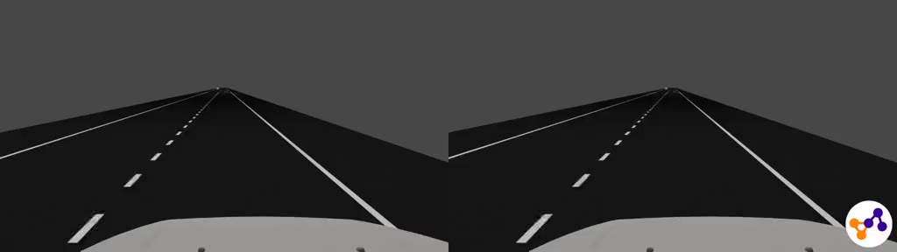
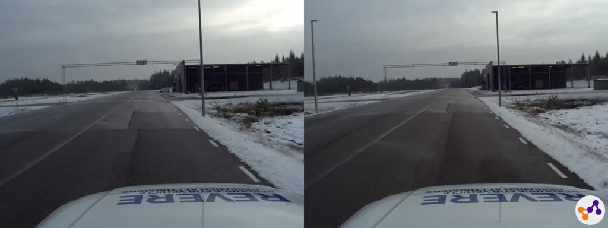

# PREPER - A Dataset for Safety Evaluation of AI Perception Systems

## Contents

- [Introduction](https://github.com/AsymptoticAI/PREPER#introduction)
- [Test setup](https://github.com/AsymptoticAI/PREPER#test-setup)
- [Directory layout, sensors, data formats](https://github.com/AsymptoticAI/PREPER#directory-layout-sensors-data-formats)
- [Coordinate systems and calibration](https://github.com/AsymptoticAI/PREPER#coordinate-systems-and-calibration)
- [KPIs](https://github.com/AsymptoticAI/PREPER#kpis)
- [Evaluation](https://github.com/AsymptoticAI/PREPER#evaluation)
- [Download, License, Citation](https://github.com/AsymptoticAI/PREPER#download-license-citation)
- [Questions, feedback, benchmark results](https://github.com/AsymptoticAI/PREPER#questions-feedback-benchmark-results)
- [Sample Videos](https://github.com/AsymptoticAI/PREPER#sample-videos)

## Introduction

Deep learning algorithms are becoming the state-of-the-art technology used in
the perception functions of AD and ADAS. With the safety assurance of level 5
AD systems the perception of the environment and especially dynamic objects
becomes a central component. Data-driven AI algorithms are to a large extent
determined by the training dataset. Interpretability and reliability of these
algorithms are known to be challenging due to their data-driven nature.

AI based perception systems need to be tested and validated. Edge cases for
testing can be derived from real world scenarios that lead to accidents caused
by human drivers. Available public data is limited to normal driving
situations, like KITTI <http://www.cvlibs.net/datasets/kitti/> or the Waymo
Open Dataset <https://waymo.com/open/>. Data that covers edge cases like safety
critical scenarios to test these systems are still lacking.

PREPER ("PRE-crash PERception") aims at providing a dataset for evaluation and
benchmarking of the safety performance of object detection in AI driven visual
perception systems for road vehicles. It is comprised of tests conducted at the
AstaZero test track located in Västra Götaland, Sweden during December 2020 and
January 2021. The test track and driving days were funded by the OpenResearch
programme by Chalmers, RISE, and SAFER and the research and data preparation
work was part of the FFI project "Safety-driven data labelling platform to
enable safe and responsible AI". The main data collection car (ego vehicle) was
provided by the laboratory of Resource for Vehicle Research at Chalmers
(REVERE).

## Test setup

All sequences in PREPER mimic pre-crash phases of two passenger cars, the ego
car (REVERE) and the target car (AstaZero). To cover a variety of pre-crash
scenarios the tests were conducted at the rural and city areas of the AstaZero
track. In total there were eight different scenarios each with several
variations of sequences that replicate the pre-crash phase of an accident
situation. The selected scenarios are based on accident data analysis, EuroNCAP
and U.S. NCAP test configurations as well as real world accident pre-crash data
from the IGLAD pre-crash matrix <http://www.iglad.net> ensuring relevance for
real life safety. Variations of the different sequences within a scenario
include:

- With and without “collision” as a reference
- Fake/critical only maneuvers
- Occlusion by another car or a building
- Different degrees of “collision” overlap
- Different speeds of the target car

Additionally, there was a leading car in some sequences for occlusion
purposes of the target car. In order to safely conduct the tests the speed of
the vehicles was lower when driving the tests than it is in the replicated
pre-crash scenarios in the PREPER data set. All sensor parameters like timestamps,
camera frame rates, lidar rotation, and speeds are transformed to a unified and
warped speed afterwards which reflects the real world speed of the pre-crash
scenarios. The tests were driven by professional drivers from AstaZero to ensure
a safe test performance. The warped speeds of the ego vehicle in rural
scenarios is 80 kph and in the city 50 kph. The warped speed of the
target car varies between the sequences. Ground truth for the leading car is
not provided as it is not part of the benchmark.

This is an overview of the scenarios and the number of sequences in each scenario:

| Test Area | Scenario     | Sequences |
| :-------- | :----------- | :-------: |
| rural     | straight     |  29       |
| rural     | curve\_left  |  31       |
| rural     | curve\_right |  30       |
| city      | cross1       |   5       |
| city      | cross2       |   6       |
| city      | cross3       |  10       |
| city      | cross4       |   8       |
| city      | turn         |  41       |
|           |              |           |
| total     |              | 160       |

## Directory layout, sensors, data formats

Each scenario is stored in a separate folder which contains a subfolder for
each sequence of that scenario. Each sequence folder contains the ground truth
data for the available sensors in that sequence. All sensors refer to the same
time scale starting at zero in the beginning of each sequence with nanosecond
precision. Each camera and lidar sensor frame is stored in a file named after
the timestamp of this frame.

### GPS/IMU

Vehicle position and orientation is captured by OxTS GPS/IMU units in both ego
and target car and an additional Applanix GPS/IMU in the ego car. The
calibrated and processed data from these units is stored in the file
`targetpose.csv` in each sequence folder and contains time, position (x, y, z
coordinates) and orientation (yaw, pitch, role) of the target vehicle.

### Cameras

There were two lossless Basler cameras mounted in the front of the ego vehicle,
one facing forward and one in a 45 degree angle to the right. The latter camera
data is provided only in the "cross" scenarios with the file suffix `_right`.
The frame rate of both cameras was 34 frames per second (warped speed). All
camera images are stored in lossless png format.

### Lidar

The lidar mounted on top of the ego car is a Velodyne HDL-32 rotating at 20Hz
(warped speed). The measurements are stored in binary files with the extension
`.bin` in each sequence folder. Each point measurement consists of four 64-bit
floating point numbers x, y, z and intensity in little-endian byte order. The
whole n x 4 point matrix is sequenced in C-order. The data can be read e.g. in
python using numpy.fromfile() on an x86\_64 machine and reshaped to a n x 4
matrix.

## Coordinate systems and calibration

The origin of the reference coordinate systems is near the center of gravity
in the ego car with the following orientation in driving direction:

- x-axis to the right
- y-axis to the front
- z-axis up

Both the target position and the lidar data measurements are relative to the
reference coordinate system.

The local coordinate system in the target car has its origin near
the center of gravity of the target car and the same axis orientations
as the ego car but relative to its own driving direction. The xy-plane
of both cars is approx. 0.40m above the ground.

Projecting points in the reference coordinate system to the front or right
camera can be accomplished with the following transformations using the OpenCV
camera coordinate system. An example for drawing a bounding box around the
target car is provided in the script `projection.py`.

Translation vectors t = [x, y, z] in meter:

    trans_front = [+0.20, +1.80, -1.50]
    trans_right = [-0.20, +1.80, -1.75]

Rotation vectors r = [pitch, yaw, roll] in degree:

    rot_front = [+4.66, -0.73, +0.00]
    rot_right = [+5.90, -43.00, +0.00]

Intrinsics for both cameras are:

    fxy = 1716
    pcx = 1072
    pcy =  699

With the intrinsic matrix:

    [ fxy, 0.0, pcx]
    [ 0.0, fxy, pcy]
    [ 0.0, 0.0, 1.0]

Distortion is neglectable for this purpose (zero-matrix 5 x 5).

## KPIs

For our benchmarking purpose we propose the notion of a collision warning KPI
as a measure that detects and assesses an upcoming collision threat. Formally,
we describe it as a function that maps a (small) set of ground truth parameters
to a (small) set of values that represent the presence and threat-level of an
expected collision at a given point in time. Obviously, the detection of an
upcoming collision needs to be as early and reliably as possible. While early
detections can help to completely avoid critical situations, late detections
enable executing counter-measures that can mitigate the collision outcome but
also can be quite drastic (emergency brake or steering maneuver) and thus have
to be reliable.

There is no general collision warning function that covers all possible
scenarios and constellations of an ego and target vehicle. A collision
assessment criterion can also be subjective and differ between drivers or take
aspects into account that are not easy to model, such as “how good is the
target car able to keep its lane”. Often, the driver’s experience also takes
predicted behavior of the driver of the target car into account based on the
context of the current situation, possibly involving other traffic
participants. For our purpose of benchmarking machine learning perception
systems with the given test scenarios we have defined two simple KPIs which are
explained in more detail in the following subsections. Python code for
calculating these KPIs from the test data is provided in a separate file
`kpis.py`. In practice, when implementing a collision warning system in a car
it is advisable to calculate several different warnings at once and decide upon
a final collision assessment based on the current driving situation.

### Collision warning "lateral offset"

The lateral offset to the target car is defined as the x-component of the
position of the target car in the ego car's (reference) coordinate system. When
it drops below a predefined threshold, the collision warning is activated. As
this warning can be calculated from the position of the target car at each
single point in time it is a static collision warning and doesn't require
object tracking. This type of collision warning is used only for the "turn"
scenarios where the target car has a higher lateral movement component than in
the other scenarios. This is due to the driver needing to avoid a real
collision in the test setup.

### Collision warning "delta bearing"

The delta bearing is defined as the change of the bearing to the target vehicle
within a predefined time interval. As we need a sliding window for tracking
the bearing to the target car it is a dynamic collision warning. As a
consequence, the AI perception system needs to provide an object tracking
mechanism to be able to calculate this warning. This warning is used for all
but the "turn" scenarios. It should be noted that this collision warning is
also triggered in the reference sequences of the "curve\_left" scenarios
because an oncoming vehicle in a left curve is on collision course at some
point. However, this is not a big limitation as the warning level (see next
section) is still low in these cases.

### Warning level

In addition to identifying a collision threat the risk level of the threat
needs to be assessed to be able to respond with appropriate measures. This
works in the same way for both "lateral offset" and "delta bearing" and only
depends on the distance of the target vehicle to the ego vehicle. Predefined
distance ranges are mapped to eight warning levels from 0 (no warning) to 7
(maximum warning level). For implementation details please have a look at the
function `warning_level()` in `kpis.py`.

## Evaluation

The object perception task of an in-vehicle AI perception system can generally
be described as detecting objects and their position and orientation (pose)
based on sensor data in real time. Usually, a 3D bounding box is drawn around
the detected objects to visualize the result. The PREPER dataset provides the
pose of the target vehicle as ground truth data and the collision warning KPIs
to identify a safety relevant warning situation. In order to assess the AI
perception system task in the context of the safety relevant PREPER sequences
the KPIs can be applied to the pose output of the AI system based on the PREPER
camera data and compared to the KPI values calculated from the PREPER ground
truth data. This way, the object detection performance of the AI system is
evaluated in the context of the collision warning task to see if the warnings
generated by the AI system are early and reliable enough compared to the same
warnings generated based on ground truth.

It is not intended to train an AI system on the PREPER data to predict the KPIs
directly. Collision situations are very diverse and infrequent so they are not
well suited for generalization. However, the pre-crash sequences in PREPER are
still sufficient to test the precision of an object detection system within
safety relevant constraints.

The lidar data supplied with PREPER can serve as an additional source of
information, especially for measuring the accurate distance to the target in
close vicinity of the ego car. However, the range of the lidar is limited.

Some AI perception systems might not provide the full target pose but generate
2D bounding boxes around the objects in the camera image along with a distance
to the object. Then it still might be possible to calculate the KPIs if the
necessary input parameters for the collision warning functions are supplied.
These are: distance, bearing, lateral offset to the object and projected object
width.

By the time the PREPER data is released a formal procedure to evaluate and
compare different results in a benchmark has not been established, yet.
However, feedback in the form of evaluation results obtained with your AI
perception algorithms are more than welcome. After obtaining a number of
different evaluation results, it should also be possible to provide a
comparison and benchmarking procedure and then this document will be updated
accordingly. When submitting your data, please provide the predicted target
poses or alternatively the collision warning function input parameters
(distance, bearing, lateral offset and projected object width) for each PREPER
sequence. In any case, please get in touch before submitting your results.

## Download, License, Citation

The PREPER dataset can be downloaded from
<https://drive.google.com/drive/folders/1IFxqBPkGjkMsQFRPUoub_90s3GM1dY2p?usp=sharing>.
The main dataset is made available as one archive named `preper.zip` containing
the camera data and target poses. The optional lidar data is stored in a
separate file named `preper_lidar.zip`. Both can be unpacked to the same
directory to obtain the full dataset. This readme, the license file and the
python script to calculate the KPIs can be downloaded in separate files from
the same link or from this repository.

All PREPER data is made available under the Open Data Commons Attribution
License ODC-By: http://opendatacommons.org/licenses/by/1.0/ and can be freely
distributed also for commercial use as long as you attribute any public use of
the database, or works produced from the database. For any use or
redistribution of the database, or works produced from it, you must make clear
to others the license of the database and keep intact any notices on the
original database, provide a link to the license, indicate if changes were
made, and give credit using the following citation:

> Bakker, Jörg. PREPER dataset for safety evaluation of AI object perception systems, 2022.
> Asymptotic AB, <https://github.com/AsymptoticAI/PREPER>

## Questions, feedback, benchmark results

For feedback, questions or if you like to provide benchmark results please
contact <jorg.bakker@asymptotic.ai>.

## Sample Videos

This section contains links to some videos of scenarios and KPI annotations of the
PREPER data. The video quality has been reduced compared to the original camera data
in order to speed up viewing the files. Click on the preview image to watch the video.

*Rural straight road simulation*

*Rural straight road test track*

*City crossing simulation*

*City crossing test track*

*Rural straight annotated*

*Rural straight leader car annotated*

*Rural curve left annotated*

*City crossing annotated*
